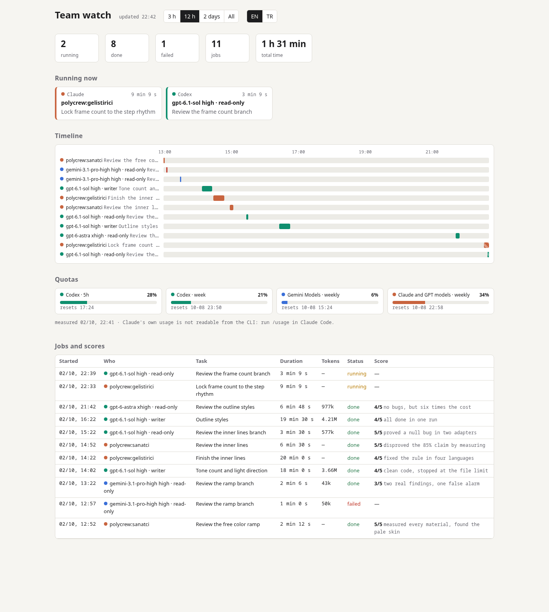

# polycrew

**A multi-model crew for Claude Code.** Long projects keep their memory between sessions, and big tasks are split across a small team: Claude roles plus external Codex and Gemini workers, picked by measured quality and cost. You can watch all of them on one live page.

[Türkçe](README.tr.md)



## What it is for

Claude Code is strong in one session, but long projects run into three problems:

1. **It forgets between sessions.** Decisions, open issues and "where we left off" live in chat history that is gone tomorrow.
2. **Agents are expensive and invisible.** Several subagents in parallel drain your usage limit within hours. In the VS Code extension they are collapsed rows, and you cannot tell who is doing what.
3. **One model is not best at everything.** Codex is a careful, cheap reviewer. Claude is the better judge of visual work. Gemini quotas are generous. Nothing tells you which to use where.

polycrew answers each one:

- **Session workflow.** Every project gets a `CLAUDE.md` (rules), a `PLAN.md` (stages with checkboxes), numbered decision notes in `docs/decisions/`, and a `SONRAKI_OTURUM.md` ("next session") hand-off with a ready start prompt. Opening and closing a session are two commands.
- **A PM-led team.** The main session acts as project manager. It splits a stage into streams and hands items to roles (developer, artist, reviewer, designer, researcher, lead). Developers work in their own git worktree and branch; only the PM merges to `main`.
- **External workers.** Codex and Gemini (through `agy`) run non-interactively with a chosen model and effort, in read-only or writer mode, with full logs. That spreads the work across three quotas.
- **A measured roster.** Which worker gets which job (by difficulty) comes from real runs with scores, time, tokens and quota use, not from guesses. See [`skills/takim/kadro.md`](skills/takim/kadro.md) and decision [`0002`](docs/decisions/0002-agent-deneyi.md).
- **Live visibility.** Hooks and the worker script write one event log. A local page shows who is running and for how long, a timeline, quota bars, each worker's last report and the PM's scores. At the end of the session the same view becomes a shareable report.

## Commands

The skill names are Turkish. Call them as `/polycrew:<name>`, or just `/<name>` when the name is unique.

| Command | Meaning | What it does |
|---|---|---|
| `/proje-kur` | set up project | Creates `CLAUDE.md`, `PLAN.md`, `SONRAKI_OTURUM.md` and `docs/decisions/` in a project; never overwrites. |
| `/oturum-ac` | open session | Reads the notes, checks git, worktrees and tests, asks for feedback, starts in plan mode. |
| `/oturum-kapat` | close session | Ticks checkboxes, writes decisions, updates the hand-off notes and the start prompt, publishes the team report, commits. |
| `/karar` | decision | Writes a short numbered decision note. |
| `/takim` | team | Runs a stage with a team: the PM splits it, assigns workers by difficulty, reviews and merges. |
| `/dis-ajan` | external agent | Runs a task on Codex or Gemini/agy (model, effort, read-only or writer) and logs everything. |
| `/izle` | watch | Opens the live team page and produces the session report. |

### Roles (`agents/`)

| Role | Default model | Writes code? | Job |
|---|---|---|---|
| `gelistirici` (developer) | Sonnet, high effort | yes, in its own worktree | Codes one item with tests and commits on its branch. |
| `gozden-gecirici` (reviewer) | Sonnet, high effort | no | Reviews a branch against the project's definition of done. |
| `sanatci` (artist) | Opus | no | Judges and measures visual output (colors, contrast, stray pixels). |
| `tasarimci` (designer) | Opus | no | Turns options into a step-by-step plan and a decision draft. |
| `arastirmaci` (researcher) | Haiku | no | Answers questions from code and the web, with sources. |
| `lider` (lead) | Sonnet | no | Runs one stream in a truly large parallel stage. |

## Requirements

- [Claude Code](https://docs.claude.com/en/docs/claude-code) (CLI, VS Code extension or desktop app).
- `bash`, `git` and Python 3 (standard library only).
- Optional, for external workers:
  - [Codex CLI](https://github.com/openai/codex), signed in;
  - `agy` (Antigravity CLI) for Gemini.
  - Neither is needed for the session workflow or the Claude team.

## Installation

From GitHub:

```bash
claude plugin marketplace add MZDemirel/polycrew
claude plugin install polycrew@polycrew
```

From a local clone (for development):

```bash
git clone https://github.com/MZDemirel/polycrew.git
claude plugin marketplace add ./polycrew
claude plugin install polycrew@polycrew
```

Then run `/reload-plugins` in an open session, or start a new one.

- **Update:** `claude plugin marketplace update polycrew && claude plugin update polycrew@polycrew`
- **Remove:** `claude plugin uninstall polycrew@polycrew`

## A typical session

```text
/proje-kur        # once per project: rules, plan, decisions, hand-off notes
/oturum-ac        # every session: read notes, check git and tests, plan
/takim            # for a stage worth a team; /izle opens the live page
/oturum-kapat     # notes, decisions, team report, commit
```

`/oturum-kapat` writes a start prompt into `SONRAKI_OTURUM.md`. Paste it next time and the new session picks up where the last one stopped.

## Watching the team

```text
/izle
```

The page runs at `http://localhost:8770`. In VS Code, open it with `Ctrl+Shift+P → Simple Browser: Show`. It is in English and Turkish: it follows your browser language, and the EN/TR buttons or `?lang=en` switch it. It refreshes every few seconds and shows:

- **Running now:** role or model, task, elapsed time.
- **Timeline:** Claude in orange, Codex in green, Gemini in blue. Click a bar to see the worker's last report and its task.
- **Quotas:** Codex 5-hour and weekly windows, Gemini, and Claude through agy. Claude's own usage cannot be read from the CLI; the page points you to `/usage`.
- **Jobs and scores:** duration, tokens, status and the PM's 1–5 score with a reason.

Under the hood:

- Hooks (`PreToolUse` on the Agent tool, `SubagentStart`, `SubagentStop`) and `dis-ajan.sh` append to one log.
- The PM adds scores with `python3 hooks/olay.py puan <job id> <1-5> "<reason>"`.
- `skills/izle/izle.py rapor --dil en --cikti report.html` renders the same view as a static page. `/oturum-kapat` publishes it.
- The screenshots come from an example log: `docs/img/ornek_gunluk.py en|tr <file>`.

## External workers (optional)

```bash
skills/dis-ajan/dis-ajan.sh codex gpt-6.1-sol high okur  <dir> task.md        # read-only review
skills/dis-ajan/dis-ajan.sh codex gpt-6.1-sol high yazar <worktree> task.md   # writes, in a worktree only
skills/dis-ajan/dis-ajan.sh kota                                              # current Codex and agy quotas
```

- **Writer mode** refuses the main working tree. Create a worktree first.
- **Workers never push** and never bypass git hooks.
- **Logs:** each run writes the task, raw output, last message, duration, tokens and exit code to `~/.cache/polycrew/dis-ajan/`.
- **agy permissions:** in headless mode, `agy` drops the whole run at the first command not in its allow list (`~/.gemini/antigravity-cli/settings.json`). Keep the rules narrow, and widen them only on purpose.
- **Model choice:** see [`kadro.md`](skills/takim/kadro.md). In the measured runs:
  - Codex `gpt-6.1-sol` was the best reviewer: every finding proven, no false alarms, about 3% of its 5-hour window per review.
  - Claude was kept for the PM, the artist and hard code.

## Data and privacy

- Everything stays on your machine:
  - the event log: `~/.cache/polycrew/olaylar.jsonl`;
  - worker logs: `~/.cache/polycrew/dis-ajan/`.
- Nothing is sent anywhere except to the CLIs you run yourself.
- The session report embeds worker reports and tasks. Look for secrets before you publish it.

## Language

- The skills, roles and notes are written in Turkish, and the workflow was built on a Turkish game-tools project.
- Claude follows them in any language. Your project's `CLAUDE.md` decides which language Claude uses with you.

## Repository layout

```text
.claude-plugin/   plugin and marketplace manifests
agents/           roles (model, effort, tools)
skills/           oturum-ac, oturum-kapat, karar, proje-kur, takim (+ kadro.md), dis-ajan (+ dis-ajan.sh), izle (+ izle.py, sayfa.html)
hooks/            SessionStart "where we left off", olay.py (event log)
docs/decisions/   why things are the way they are
deney/            measured runs: tasks, answer keys, scores
tests/            unit tests for the event log and the live page
```

## Development

```bash
claude plugin validate .
bash -n hooks/nerede_kaldik.sh skills/dis-ajan/dis-ajan.sh
python3 -m unittest discover tests
python3 skills/izle/izle.py --port 8771      # try the page; POLYCREW_OLAYLAR=<file> for a test log
```

The plugin follows its own workflow: [`PLAN.md`](PLAN.md), [`SONRAKI_OTURUM.md`](SONRAKI_OTURUM.md) and [`docs/decisions/`](docs/decisions/).

## License

[MIT](LICENSE)
