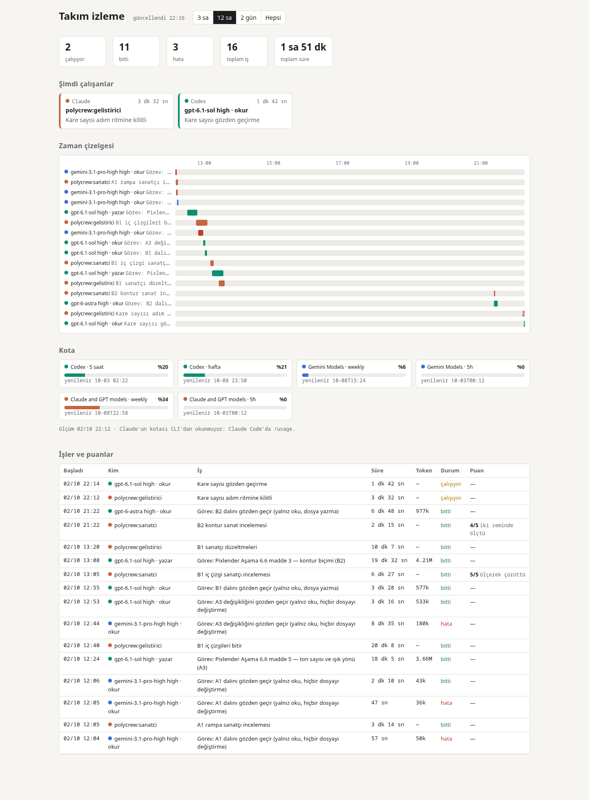

# polycrew

**Claude Code için çok modelli kadro.** Uzun projeler oturumdan oturuma hafızasını korur. Büyük işler küçük bir takıma bölünür: Claude rolleri ve dış işçi olarak Codex ve Gemini, ölçülmüş kalite ve maliyete göre seçilir. Hepsini tek bir canlı sayfadan izlersin.

[English](README.md)



## Ne işe yarar

Claude Code tek bir oturumda güçlü. Uzun projelerde ise üç sorun çıkar:

1. **Oturumdan oturuma unutur.** Kararlar, açık işler ve "nerede kaldık" sohbet geçmişinde kalır; ertesi gün yoktur.
2. **Agent'lar pahalı ve görünmez.** Paralel birkaç alt agent kullanım limitini birkaç saatte bitirir. VS Code eklentisinde katlanmış satırlar olarak durdukları için kimin ne yaptığı görünmez.
3. **Her işte en iyi tek bir model yok.** Codex dikkatli ve ucuz bir gözden geçirici. Görsel işi Claude daha iyi yargılıyor. Gemini'nin kotası bol. Hangisinin nerede kullanılacağını söyleyen bir şey yok.

polycrew her birine bir cevap veriyor:

- **Oturum düzeni.** Her projede `CLAUDE.md` (kurallar), `PLAN.md` (checkbox'lı aşamalar), `docs/decisions/` altında numaralı karar notları ve hazır başlangıç promptlu `SONRAKI_OTURUM.md` bulunur. Oturumu açmak ve kapatmak iki komuttur.
- **PM'in yönettiği takım.** Ana oturum proje yöneticisidir. Aşamayı akışlara böler, maddeleri rollere verir: geliştirici, sanatçı, gözden geçirici, tasarımcı, araştırmacı, lider. Geliştiriciler kendi git worktree'sinde ve dalında çalışır; `main`'e yalnız PM birleştirir.
- **Dış işçiler.** Codex ve Gemini (`agy` üzerinden), seçilen model ve eforla, okur ya da yazar kipte, etkileşimsiz ve tam kayıtla çalışır. Böylece iş üç ayrı kotaya dağılır.
- **Ölçülmüş kadro.** Hangi işin (zorluğuna göre) hangi işçiye gideceği tahminden değil, gerçek koşulardan gelir: puan, süre, token ve kota payı. Bkz. [`skills/takim/kadro.md`](skills/takim/kadro.md) ve karar [`0002`](docs/decisions/0002-agent-deneyi.md).
- **Canlı görünürlük.** Kancalar ve işçi betiği tek bir olay günlüğüne yazar. Yerel bir sayfada şunlar görünür: kim çalışıyor ve ne zamandır, zaman çizelgesi, kota çubukları, her işçinin son raporu ve PM'in puanları. Oturum sonunda aynı görünüm paylaşılabilir bir rapora dönüşür.

## Komutlar

`/polycrew:<ad>` ya da, ad tek olduğunda, yalnız `/<ad>` ile çağrılır.

| Komut | Ne yapar |
|---|---|
| `/proje-kur` | Projeye `CLAUDE.md`, `PLAN.md`, `SONRAKI_OTURUM.md` ve `docs/decisions/` kurar; var olanın üstüne yazmaz. |
| `/oturum-ac` | Notları okur; git'i, worktree'leri ve testleri denetler; geri bildirimi sorar; plan moduyla başlar. |
| `/oturum-kapat` | Checkbox'ları işaretler, kararları yazar, notları ve başlangıç promptunu günceller, takım raporunu yayımlar, commit atar. |
| `/karar` | Numaralı kısa bir karar notu yazar. |
| `/takim` | Bir aşamayı takımla yapar: PM böler, işi zorluğa göre dağıtır, gözden geçirtir, birleştirir. |
| `/dis-ajan` | Bir görevi Codex'e ya da Gemini/agy'ye yaptırır (model, efor, okur ya da yazar) ve her şeyi kaydeder. |
| `/izle` | Canlı takım sayfasını açar, oturum raporunu üretir. |

### Roller (`agents/`)

| Rol | Varsayılan model | Kod yazar mı? | İşi |
|---|---|---|---|
| `gelistirici` | Sonnet, yüksek efor | evet, kendi worktree'sinde | Bir maddeyi testleriyle kodlar, kendi dalında commit atar. |
| `gozden-gecirici` | Sonnet, yüksek efor | hayır | Bir dalı projenin bitti tanımına göre denetler. |
| `sanatci` | Opus | hayır | Görsel çıktıyı yargılar ve ölçer (renk, kontrast, tek kalan piksel). |
| `tasarimci` | Opus | hayır | Seçeneklerden adım adım plan ve karar taslağı çıkarır. |
| `arastirmaci` | Haiku | hayır | Kodda ve webde araştırır, kaynaklarıyla cevaplar. |
| `lider` | Sonnet | hayır | Gerçekten büyük ve paralel bir aşamada bir akışı yürütür. |

## Gereksinimler

- [Claude Code](https://docs.claude.com/en/docs/claude-code) (CLI, VS Code eklentisi ya da masaüstü uygulaması).
- `bash`, `git` ve Python 3 (yalnız standart kütüphane).
- Dış işçiler için (isteğe bağlı):
  - [Codex CLI](https://github.com/openai/codex), giriş yapılmış;
  - Gemini için `agy` (Antigravity CLI).
  - Oturum düzeni ve Claude takımı bunlar olmadan da çalışır.

## Kurulum

GitHub'dan:

```bash
claude plugin marketplace add MZDemirel/polycrew
claude plugin install polycrew@polycrew
```

Yerel kopyadan (geliştirme için):

```bash
git clone https://github.com/MZDemirel/polycrew.git
claude plugin marketplace add ./polycrew
claude plugin install polycrew@polycrew
```

Ardından açık oturumda `/reload-plugins` çalıştır ya da yeni bir oturum aç.

- **Güncelleme:** `claude plugin marketplace update polycrew && claude plugin update polycrew@polycrew`
- **Kaldırma:** `claude plugin uninstall polycrew@polycrew`

## Tipik bir oturum

```text
/proje-kur        # proje başına bir kez: kurallar, plan, kararlar, devir notu
/oturum-ac        # her oturum: notları oku, git ve testleri denetle, planla
/takim            # takıma değecek bir aşamada; /izle canlı sayfayı açar
/oturum-kapat     # notlar, kararlar, takım raporu, commit
```

`/oturum-kapat`, `SONRAKI_OTURUM.md`'ye bir başlangıç promptu yazar. Bir dahaki sefere onu yapıştırırsın; yeni oturum kalınan yerden başlar.

## Takımı izlemek

```text
/izle
```

Sayfa `http://localhost:8770` adresinde açılır. VS Code'da `Ctrl+Shift+P → Simple Browser: Show` ile açılır. Birkaç saniyede bir yenilenir ve şunları gösterir:

- **Şimdi çalışanlar:** rol ya da model, iş, geçen süre.
- **Zaman çizelgesi:** Claude turuncu, Codex yeşil, Gemini mavi. Bir şeride tıklayınca işçinin son raporu ve görevi açılır.
- **Kota:** Codex'in 5 saatlik ve haftalık penceresi, Gemini, agy üzerinden Claude. Claude'un kendi kullanımı CLI'dan okunmuyor; sayfa `/usage`'ı gösterir.
- **İşler ve puanlar:** süre, token, durum ve PM'in gerekçeli 1–5 puanı.

Arka planda:

- Kancalar (Agent aracında `PreToolUse`, `SubagentStart`, `SubagentStop`) ve `dis-ajan.sh` tek bir günlüğe yazar.
- PM puanı `python3 hooks/olay.py puan <iş id> <1-5> "<gerekçe>"` ile ekler.
- `skills/izle/izle.py rapor --cikti rapor.html` aynı görünümü durağan bir sayfa olarak üretir; `/oturum-kapat` onu yayımlar.

## Dış işçiler (isteğe bağlı)

```bash
skills/dis-ajan/dis-ajan.sh codex gpt-6.1-sol high okur  <klasör> gorev.md     # yalnız okur: gözden geçirme
skills/dis-ajan/dis-ajan.sh codex gpt-6.1-sol high yazar <worktree> gorev.md   # yazar, yalnız worktree'de
skills/dis-ajan/dis-ajan.sh kota                                              # Codex ve agy'nin güncel kotası
```

- **Yazar kip** ana çalışma ağacını reddeder; önce bir worktree aç.
- **İşçiler push etmez** ve git kancasını atlatmaz.
- **Kayıt:** her koşu görevi, ham çıktıyı, son mesajı, süreyi, token'ı ve çıkış kodunu `~/.cache/polycrew/dis-ajan/` altına yazar.
- **agy izinleri:** etkileşimsiz kipte `agy`, izin listesinde (`~/.gemini/antigravity-cli/settings.json`) olmayan ilk komutta bütün işi düşürür. Kuralları dar tut; genişletmeyi bilerek yap.
- **Model seçimi:** bkz. [`kadro.md`](skills/takim/kadro.md). Ölçülen koşularda:
  - en iyi gözden geçirici Codex `gpt-6.1-sol` çıktı: her bulgu kanıtlı, yanlış alarm yok, inceleme başına 5 saatlik pencerenin yaklaşık %3'ü;
  - Claude PM, sanatçı ve zor kod için ayrıldı.

## Veri ve gizlilik

- Her şey senin makinende kalır:
  - olay günlüğü: `~/.cache/polycrew/olaylar.jsonl`;
  - işçi kayıtları: `~/.cache/polycrew/dis-ajan/`.
- Senin çalıştırdığın CLI'lar dışında hiçbir yere bir şey gönderilmez.
- Oturum raporu işçi raporlarını ve görevleri içinde taşır; yayımlamadan önce gizli bilgi olmadığına bak.

## Dil

- Skill'ler, roller ve notlar Türkçe yazıldı; düzen Türkçe bir oyun aracı projesinde kuruldu.
- Claude bunları her dilde uygular. Seninle hangi dilde konuşacağını projenin `CLAUDE.md`'si belirler.

## Depo düzeni

```text
.claude-plugin/   eklenti ve marketplace tanımları
agents/           roller (model, efor, araçlar)
skills/           oturum-ac, oturum-kapat, karar, proje-kur, takim (+ kadro.md), dis-ajan (+ dis-ajan.sh), izle (+ izle.py, sayfa.html)
hooks/            SessionStart "nerede kaldık", olay.py (olay günlüğü)
docs/decisions/   neden böyle olduğu
deney/            ölçülen koşular: görevler, cevap anahtarları, puanlar
tests/            olay günlüğü ve canlı sayfa için birim testleri
```

## Geliştirme

```bash
claude plugin validate .
bash -n hooks/nerede_kaldik.sh skills/dis-ajan/dis-ajan.sh
python3 -m unittest discover tests
python3 skills/izle/izle.py --port 8771      # sayfayı dene; deneme günlüğü için POLYCREW_OLAYLAR=<dosya>
```

Eklenti kendi düzeniyle geliştirilir: [`PLAN.md`](PLAN.md), [`SONRAKI_OTURUM.md`](SONRAKI_OTURUM.md) ve [`docs/decisions/`](docs/decisions/).

## Lisans

[MIT](LICENSE)
