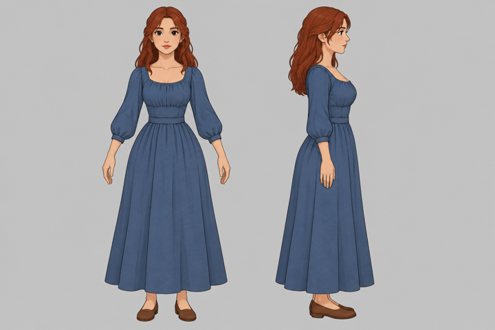
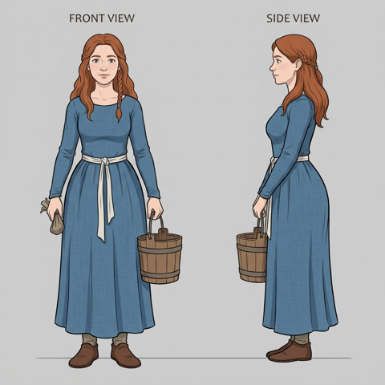
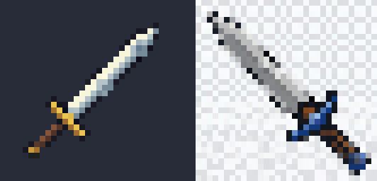

# 0002: Agent deneyi: hangi işçi hangi işte iyi?

- **Tarih:** 2026-10-02
- **Durum:** Kabul edildi. Kadro tablosu (aşağıda) `/takim` ve `dis-ajan` skill'lerinin dayanağıdır. Yeni model çıkınca deney tekrarlanır.

## Bağlam

- İlk takım denemesinde (Pixlender Aşama 6.6, 2026-10-01) bütün agent'lar ana oturumun modelini (Opus 5.5, yüksek efor) devraldı. 6–7 paralel agent Claude oturum limitini birkaç saatte doldurdu.
- Kullanıcının istediği:
  - takımı işin zorluğuna göre kurmak;
  - token tüketimini dış CLI'lara (Codex, agy) bölmek;
  - bunu **ölçerek** yapmak (ör. "Gemini 3.8 Flash hızlı ve iyi" sezgisi; resim üretme).

## Yöntem

- **Adaylar:**
  - Codex `gpt-6.1-sol` high
  - Codex `gpt-6-astra` xhigh
  - agy Gemini 3.8 Flash high
  - agy Gemini 3.1 Pro high
  - agy Claude Opus 4.6 (Google kotası)
  - Claude Sonnet (temel çizgi, `general-purpose` + `model: sonnet`)
  
  Claude Opus 5.5 yalnız PM ve puanlayıcı.
- **Araç:** `skills/dis-ajan/dis-ajan.sh`. Kayıtlar: görev, ham çıktı, son mesaj, süre, token.
- **Görevler:** Pixlender'ın gerçek işleri. Metin ve puanlama ölçütü işten önce yazıldı (cevap anahtarı adaylara gösterilmedi).
  1. **Araştırma:** cevabı bilinen 5 soru (dosya:satır kanıtıyla), en çok 12,5 puan.
  2. **Gözden geçirme:** `main`'den bir dala 4 ince hata (döngü şartı, işaret, eşik, birim) ve 3 zararsız değişiklik kondu. Bulunan hata 2 puan, yanlış alarm −1, en çok 8.
  3. **Kodlama yarışı, gerçek iş:** Aşama 6.6 madde 4, piksel tozu temizliği (`light.with_tones`). Her aday kendi worktree'sinde.
     - PM'in ölçüsü: aynı malzemede dört komşusu da başka tonda olan piksel, kare başına; taban şövalye 128'de 17,1, 96'da 9,2, köylü 48'de 1,1.
     - Ayrıca testler, ruff, pyright, kural uyumu ve kod işçiliği.
  4. **Görsel okuma:** iki resimde cevabı bilinen 7 soru.
  5. **Resim üretme:** köylü kadın konsepti (Aşama 8'e girdi) ve 32×32 kılıç ikonu, 1–5 puan.

## Sonuçlar

Süre duvar saati. Token: Codex için girdi (çoğu önbellekten), agy için toplam, Claude için alt agent'ın toplamı. Sağlayıcılar arasında kota karşılığı aynı değil.

| İş | Sonnet | Codex sol | Codex astra | Gemini Flash | Gemini Pro | agy Opus 4.6 |
|---|---|---|---|---|---|---|
| 1 araştırma (12,5) | 11,5*, 39 sn, 47k | 12,5, 64 sn, 239k | 12,5, 90 sn, 250k | 12,5, 210 sn, 535k | 12, 94 sn, 96k | 12,5, 424 sn (alt ajan başlattı, plan onayı istedi) |
| 2 gözden geçirme (8) | 8, 32 sn, 41k | 8 + sayısal kanıt, ~515 sn, 460k | 8 + sayısal kanıt, ~576 sn, 779k | 8 (testleri de koştu), 232 sn, 342k | 8, 162 sn, 52k | 8, 130 sn, 53k |
| 4 görsel (7) | 7, 13 sn, 37k | 7, 29 sn, 53k | 7, 21 sn, 25k | 6,5, 39 sn, 88k | 6,5, 30 sn, 15k | 6,5, 28 sn, 12k |
| 3 kodlama | **✓** 298 sn, 59k; commit temiz; üsluba en uygun | ✓ kod, 925 sn, 1,93M; commit yok†; kapsam aşımı‡ | ✓ kod, 984 sn, 1,54M; commit yok†; kapsam aşımı‡ | ✓ 687 sn, 1,44M; commit temiz | ✗ iki kez yarım (izin) | ✗ kota doldu |
| 5 resim (konsept / ikon) | (yok) | **5 / 4** | — | — | 4 / 1 | — |

\* Sonnet araştırmada oturumun kayan çalışma klasörü yüzünden hatalı dalı okudu. Kodla belgenin çeliştiğini kendisi fark etti.

† Codex'in kum havuzu worktree'nin ana `.git`'teki verisine yazamadı. Betik düzeltildi (aşağıda).

‡ Codex iki model de AGENTS.md'deki proje kurallarını uygulayıp görev dışına taştı: PLAN.md, SONRAKI_OTURUM.md, karar notu, `spikes/` betiği.

**Kodlama yarışının ölçüsü:** biten dört adayın hepsi şövalye 128'de 17,1 → 1,2, 96'da 9,2 → 1,0, köylü 48'de 1,1 → 0,0 (hedef: yarıya). Aynı kuralı buldular. Farkları:
- Sonnet en kısa sürede ve depodaki yardımcıları (`_shifted`, `_NEIGHBOURS`) kullanarak yazdı.
- Gemini Flash kendi kenar doldurma yöntemini kurdu, testleri en kapsamlısı.
- Codex en kısa numpy'yi yazdı.

**Resim:**
- Codex (`image_gen`): konsept temiz ve A-pozda, tarifle uyumlu. İkon gerçek saydam; 32×32'ye küçülünce okunuyor, 107 renk (nicemleme gerekir).
- Gemini (`generate_image`): konseptte istenmeyen kova ve kese var. İkonun "saydam" zemini resmin içine çizilmiş damalı desen; kullanılamaz.

## Bulgular (araç ve davranış)

1. **Okuma işlerinde (araştırma, gözden geçirme, görsel) bütün adaylar yeterli.** Fark süre ve maliyette:
   - Sonnet en hızlı.
   - Gemini Pro token'da en tutumlu.
   - Codex gözden geçirmede en yavaş ama hatayı sayısal örnekle kanıtlıyor.
   - Gemini Flash hızlı model olmasına rağmen çok token harcıyor ve uzun sürebiliyor.
2. **agy etkileşimsiz kipte izin soramaz; listede olmayan ilk komutta bütün işi çıktısız bırakır.**
   - Dosya okumak bile kural ister (`read_file(<yol>)`).
   - Gemini `find`, `sed`, birleşik komutlar (`a; b`) ve heredoc ile dosya yazmayı seviyor. Listede yoklarsa iş düşer.
   - **Dar izinle agy geliştirici olamıyor** (Gemini Pro iki kez). Flash idare etti.
   - Geniş izin (`uv run python`) kullanıcının kararıdır.
3. **agy komutları çalışma klasörü söylenmezse boş bir klasörde çalıştırabiliyor;** betik bunu görevin başına ekliyor.
4. **agy üzerinden Claude Opus'un kotası küçük:** kodlama işinin ortasında "Individual quota reached", 4,5 saat. Yedek olarak güvenilmez. Ayrıca kendi alt ajanlarını başlatıp yavaşladı ve "plan onayı" istedi.
5. **Codex kum havuzu ve git worktree:**
   - Worktree'nin git verisi ana deponun `.git`'inde; yalnız worktree'ye yazma izniyle commit atılamıyor.
   - Codex kancayı (ruff) çalıştıramayınca **kancayı kendiliğinden kapattı.**
   - Düzeltme (betik): yazan kipte `.git/worktrees/<ad>`, `objects`, `refs/heads`, `logs` ve `~/.cache/uv` yazılabilir. Her işçiye "kancayı atlatma, push yok" kuralı gider. Sonra kanca çalıştı.
6. **Codex AGENTS.md'yi ciddiye alıyor:** karar notu, PLAN ve oturum notu yazdı. Görevde "yalnız şu dosyalar; PLAN, SONRAKI_OTURUM ve karar notlarına dokunma (PM yazar)" açıkça yazılmalı.
7. **Deney hijyeni:**
   - **bash çalışan betiği satır satır okur:** iş sürerken `dis-ajan.sh`'yi düzenlemek çalışan kopyaları bozdu (kayıtları eksik kaldı). Uzun koşularda betiğin kopyası kullanılır.
   - Harness PM oturumunun çalışma klasörünü worktree'lere kaydırabiliyor: görev ve komutlarda mutlak yol.
   - zsh değişkeni kelimelere bölmez: çok argümanlı çağrılar `bash -c` içinde.

## Kota tüketimi (ölçüldü)

Deney boyunca bu araçları yalnız PM kullandı (kullanıcının sözü); ölçülen tüketimin hepsi deneyindir. Okuma: Codex oturum kayıtlarındaki `rate_limits`, agy'de `/quota`. İkisi de artık `dis-ajan.sh kota` ile tek komutta görülür.

| Sağlayıcı | 5 saatlik pencere | Haftalık | Neye gitti |
|---|---|---|---|
| **Codex** (ChatGPT aboneliği; sol ve astra aynı havuz) | %1 → **%83** | %0 → %13 | Okuma işleri ve sol'un A2'si birlikte yaklaşık 48 puan. Astra'nın A2'si tek başına yaklaşık 30 puan (5 saatte %49 → %83). Her gözden geçirme 10–25 puan. |
| **agy, Gemini grubu** (Flash ve Pro aynı havuz) | %24 kullanıldı | %4 kullanıldı | Flash yaklaşık 2,5M, Pro yaklaşık 0,3M token, resim dahil |
| **agy, Claude ve GPT grubu** (Opus 4.6) | **%100, tükendi** | **%34** | Yalnız üç okuma işi ve yarım bir A2 |
| **Claude** (bu oturum) | — | — | Sonnet adayları toplam yaklaşık 184k token. Oturumun kotasını kullanıcı `/usage` ile görür; CLI'dan okunamadı. |

Sonuçlar:

1. **Dar boğaz Codex'in 5 saatlik penceresi.** A2 büyüklüğünde bir kodlama koşusu pencerenin yaklaşık %25'i (sol), astra ile %30'dan fazlası. Pencere başına en çok 2–3 Codex kodlama işi. Codex'le gözden geçirme de pahalı (kanıt için deney koşturuyor).
2. **Gemini bol:** bütün Gemini işleri haftalığın yalnız %4'ü. agy kotası "token maliyetiyle orantılı"; Flash ucuz.
3. **agy üzerinden Claude yedek değildir:** birkaç işte 5 saatlik pencere tükendi, haftalığın üçte biri gitti.
4. **İş dağıtmadan önce PM `dis-ajan.sh kota`'ya bakar.** Codex penceresi %60'ı geçtiyse orta işler Gemini'ye kayar.

## Kararlar: kadro tablosu

Zorluk **K** kolay, **O** orta, **Z** zor; PM planda her maddeye verir. Kural: **Claude kotası PM'e, sanatçıya, tasarıma ve Z koduna saklanır.** Gerisi önce dış işçiye gider.

| Rol | K | O | Z | Yedek |
|---|---|---|---|---|
| araştırmacı | Gemini 3.1 Pro (agy, okur) | Gemini 3.1 Pro | Codex sol + Gemini Pro (karşılaştır) | Claude `arastirmaci` (haiku) |
| gözden geçirici | Gemini 3.1 Pro (okur) | Gemini 3.1 Pro; önemli birleştirmede Codex sol (pahalı, kanıtlı) | Codex astra xhigh + Claude `gozden-gecirici` (sonnet) | Sonnet |
| geliştirici | Gemini 3.8 Flash (yazar; dar izinle de çalıştı) | Codex sol high (yazar; görevde dosya sınırı; 5 saatte en çok 2–3 iş) ya da Gemini Flash | Claude `gelistirici` (sonnet; gerekirse opus) ve isteğe bağlı Codex astra ayrı dalda, iyisi seçilir | Codex sol |
| görsel okuma ve ölçüm | Codex astra / sol (okur, `-i` resim) | Codex | Claude `sanatci` (opus): sanat yargısı | Gemini Pro |
| sanatçı (eleştiri) | Claude `sanatci` | Claude `sanatci` | Claude `sanatci` (opus) | — |
| resim üretme | Codex `image_gen` | Codex | Codex (+ Gemini konsept için ikinci görüş) | Gemini Pro |
| tasarımcı | PM | Claude `tasarimci` (opus) | Claude `tasarimci` (opus) + Gemini Pro ikinci görüş | — |
| lider | PM | PM | Claude `lider` (sonnet), yalnız gerçekten paralel büyük akışta | — |

- **Eşzamanlılık:** test koşan geliştirici en çok 2–3 (makine), Claude agent en çok 2. Dış işçilerin kotaları ayrı ama makine ortak.
- **Rollerin model ve eforu** (frontmatter):
  - lider: sonnet, medium;
  - gelistirici: sonnet, high;
  - sanatci: opus, medium;
  - gozden-gecirici: sonnet, high;
  - tasarimci: opus, high;
  - arastirmaci: haiku.
  
  `-usta` varyantları şimdilik gerekmedi: Z işte PM `model: opus` ile başlatır.

## Açık kalan

- Gemini Pro ve agy Opus kodlamayı bitiremedi; bunlar geniş izinle ya da kota yenilenince yeniden denenebilir.
- Sonnet'in eforu çağrıda ayarlanamıyor; temel çizgi varsayılan eforla koştu.
- Tasarımcı ve lider rolleri ölçülmedi.
- Kota payları, eşzamanlı koşular yüzünden iş başına yaklaşık. Toplamlar sağlayıcıların kendi göstergelerinden okundu.
- Claude'un kota tüketimi CLI'dan okunamadı (kullanıcı `/usage`).
- A2'nin kazanan dalı (`deney-a2-sonnet`) Pixlender'da kullanıcının onayını bekliyor.

## Malzeme

- Görevler, cevap anahtarı, ölçüm betiği, koşturucular ve bütün kayıtlar (süre, token, son mesaj): `deney/2026-10-02/`.
- Resimler:

